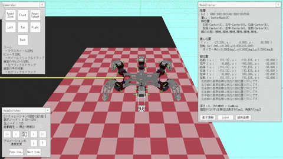

<div align="center">
    <p>
        
        
    </p>
</div>

# グラフ探索による歩容生成 / Gait Pattern Generation for Graph Search

Visual Studioで開発した，グラフ探索を用いた6脚ロボットの歩容生成を行うためのシミュレータです．
卒業研究のために作成したプログラムで，研究の題目は"グラフ探索を用いた多脚ロボットの歩容パターン生成における脚軌道生成失敗時の歩容パターンの再評価手法"です．

## 目次

- [概要](#概要)
- [開発環境](#開発環境)
- [依存するライブラリ](#依存するライブラリ)
- [導入方法](#導入方法)
- [使い方](#使い方)
- [実行/コンパイルすることができない場合](#実行コンパイルすることができない場合)

## 概要

グラフ探索による4脚ロボットの自由歩容生成を行う研究[^1]を拡張した，6脚ロボットの自由歩容生成を行うプログラムです．
グラフ探索による歩容生成の結果を，グラフィカルに表示するシミュレータの機能を持っています．
また，歩容生成の結果やマップの状態を保存し，後から読み込むことができます．

[^1]: Pal, Prabir K., and K. Jayarajan, “Generation of Free Gait-A Graph Search Approach”, IEEE Transactions on Robotics and Automation, Vol.7,No.3,pp.299-305, 1991.  

## ドキュメント

ソースコードについての，Doxygenによるドキュメントは[こちら](https://hase111111.github.io/gait-generation-by-graph-search/)にあります．

## 開発環境

私が開発に使用した環境は以下の通りです．

- Windows 10
- Visual Studio 2022

また，使用したライブラリのバージョンは以下の通りです．

- DxLib: 3.24b
- Boost: 1.82.0
- magic_enum: 0.9.6
- toml11: 3.7.1
- strconv: 1.8.10
- doctest: 2.4.11

C++はVisual Studio 2022のコンパイラを使用してコンパイルしています．
また，バージョンはC++20を使用しています．

なお，命名規則は[Google C++ スタイルガイド](https://google.github.io/styleguide/cppguide.html)にしたがっています．
加えて，一貫性のあるコーディングのため，cpplint.pyによるコードの静的解析を行っています．

## 依存するライブラリ

本プログラムは以下のライブラリに依存しています．

- [DxLib](https://dxlib.xsrv.jp/) DirectXを用いたゲームライブラリ
- [Boost](https://www.boost.org/) C++の拡張ライブラリ
- [magic_enum](https://github.com/Neargye/magic_enum) C++の列挙型を扱いやすくするためのライブラリ
- [toml11](https://github.com/ToruNiina/toml11) TOML形式のファイルを扱うためのライブラリ
- [strconv](https://github.com/javacommons/strconv) マルチバイト文字列とワイド文字列の間の変換を行うためのライブラリ
- [doctest](https://github.com/doctest/doctest) C++向けのテストフレームワーク

DxLibとBoost以外のライブラリは，ヘッダオンリーライブラリのため，本プロジェクト内にソースコードが含まれています．
よって，新たにインストールする必要はありません．
DxLibとBoostについては，[DxLib，Boostの導入方法](../docs/mark_down/how_to_install_library.md)にしたがってインストールしてください．

## 導入方法

導入のためには，以下の手順を実行してください．

##### 1. レポジトリのクローン

まずは，本レポジトリをクローンする必要があります．（レポジトリのクローンとは，GitHub上のファイルを自分のPCにダウンロードすることだと思ってください．）
そのためには，「git」をインストールしている必要があります．gitをインストールしていない場合は，[こちら](https://git-scm.com/)からインストーラをダウンロードして，実行してください．
gitのインストールが完了したら，コマンドプロンプトを開いてください（Windowsキー+Rで検索窓を開き，cmdと入力してEnterを押すとコマンドプロンプトが実行されます）．
そして，以下のコマンドを実行してください．

```bash
cd <クローンしたいフォルダへのパス>
git clone https://github.com/hase111111/gait-generation-by-graph-search.git
```

たとえば，デスクトップ直下にある「Project」フォルダにクローンしたい場合は，以下のように入力してください．

```bash
cd C:\Users\<ユーザ名>\Desktop\Project
git clone https://github.com/hase111111/gait-generation-by-graph-search.git
```

これで，レポジトリがクローンされました．

##### 2. ライブラリの導入

ライブラリとは，特定のプログラムを他のプログラムから引用できる状態にして集めたファイルのことです．
このプロジェクトは前項で述べたライブラリに依存しているため，それらのライブラリを導入する必要があります．
[DxLib，Boostの導入方法](../docs/mark_down/how_to_install_library.md)にしたがって，DxLibとBoostを導入してください．
なお，ヘッダオンリーライブラリであるmagic_enum，toml11，strconv，doctestは，本プロジェクト内にソースコードが含まれているため，新たにインストールする必要はありません．

##### 3. プロジェクトのビルド

プロジェクトをビルドするためには，Visual Studioが必要です．
まずは[Visual Studioの公式サイト](https://visualstudio.microsoft.com/ja/)からインストールしてください．
Visual Studioをインストールしたら，ソリューションファイル（拡張子が「.sln」のファイル）を開いてください．
ソリューションファイルは，クローンしたフォルダ内にあります．

ビルドを行う前に，ライブラリのパスを通す必要があります．
[DxLib，Boostの導入方法](../docs/mark_down/how_to_install_library.md)にしたがって，ライブラリのパスを通してください．

Visual Studioでは「Ctrl + F5」を押すことで，プログラムがコンパイル / ビルドされます．
プロジェクトの構成が「Release」「x64」になっていることを確認してから，「Ctrl + F5」を押してください．

## 使い方

使い方については，[使い方](../docs/mark_down/how_to_use.md)を参照してください．

ビルド済みの実行ファイルは，[Release](https://github.com/hase111111/gait-generation-by-graph-search/releases/tag/v1.0.0)から入手可能です．

## 実行/コンパイルすることができない場合

このプログラムを使用するのは，機械系の学生が多いと思います．
そのため，gitやVisual Studioなどのツールに慣れていない方もいるかもしれません．
各ツールの使い方について，ある程度丁寧に説明しているつもりですが，それでもうまくいかないことがあるかもしれません．
エラーがでたり，説明に書いてある通りに実行できなかったりする場合は，必ずWebブラウザーで検索することを心がけてください．
多くの場合，同じようなエラーが過去に発生していて，その解決策がネット上に載っていることが多いです．
検索の仕方が分からない，という場合は出力されたエラーメッセージをそのまま検索のキーワードとすることを推奨します．
また，Chat GptなどのAIを使って質問することもできます．ぜひ活用してください．

よくあるエラーの例とその解決策については，[エラーとその解決策](../docs/mark_down/error_and_solution.md)にまとめています．
エラーが出た場合は，まずはこちらを参照してください．
