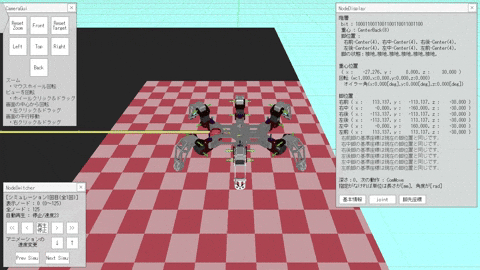

<div align="center">
    <p>
        
        
    </p>
</div>

# Gait Pattern Generation for Graph Search

This is a simulator for generating gait patterns for a hexapod robot using graph search, developed in Visual Studio. It is a program created for my graduation research, titled "A Re-Evaluation Method for Gait Patterns in Multi-Legged Robot Gait Generation Using Graph Search When Leg Trajectory Generation Fails."

The Japanese version is [here](./README_ja.md).

## Table of Contents

- [Overview](#overview)
- [Development Environment](#development-environment)
- [Dependencies](#dependencies)
- [Installation](#installation)
- [Usage](#usage)
- [Troubleshooting](#troubleshooting)

## Overview

This program extends a study on generating free gait patterns for quadruped robots using graph search[^1] to generate free gait patterns for hexapod robots. It features a simulator that graphically displays the results of gait generation using graph search. Additionally, it allows saving and loading gait generation results and map states.

[^1]: Pal, Prabir K., and K. Jayarajan, “Generation of Free Gait-A Graph Search Approach,” IEEE Transactions on Robotics and Automation, Vol.7, No.3, pp.299-305, 1991.

## Documentation

Doxygen-generated documentation for the source code is available [here](https://hase111111.github.io/gait-generation-by-graph-search/).

## Development Environment

The development environment I used is as follows:

- Windows 10
- Visual Studio 2022

The library versions used are:

- DxLib: 3.24b
- Boost: 1.82.0
- magic_enum: 0.9.6
- toml11: 3.7.1
- strconv: 1.8.10
- doctest: 2.4.11

The program is compiled using the Visual Studio 2022 compiler with C++20. The naming conventions follow the [Google C++ Style Guide](https://google.github.io/styleguide/cppguide.html), and I perform static code analysis using `cpplint.py` to ensure consistent coding practices.

## Dependencies

This program depends on the following libraries:

- [DxLib](https://dxlib.xsrv.jp/): A game library using DirectX
- [Boost](https://www.boost.org/): A set of C++ libraries for advanced programming
- [magic_enum](https://github.com/Neargye/magic_enum): A library to handle C++ enumerations more easily
- [toml11](https://github.com/ToruNiina/toml11): A library for working with TOML files
- [strconv](https://github.com/javacommons/strconv): A library for converting between multibyte and wide character strings
- [doctest](https://github.com/doctest/doctest): A lightweight C++ testing framework

Except for DxLib and Boost, the other libraries are header-only and included in this project. Therefore, no additional installation is necessary. Please follow the instructions in [How to Install DxLib and Boost](../docs/mark_down/how_to_install_library.md) for their installation.

## Installation

Follow the steps below to set up the program.

### 1. Clone the Repository

First, clone this repository (cloning means downloading the files from GitHub to your PC). To do this, you need to have `git` installed. If you don’t have it installed, download and run the installer from [here](https://git-scm.com/).

Once `git` is installed, open a command prompt (press `Windows Key + R`, type `cmd`, and press Enter). Then execute the following commands:

```bash
cd <path-to-folder>
git clone https://github.com/hase111111/gait-generation-by-graph-search.git
```

For example, if you want to clone it to a "Project" folder on your desktop, type:

```bash
cd C:\Users\<your-username>\Desktop\Project
git clone https://github.com/hase111111/gait-generation-by-graph-search.git
```

This will clone the repository.

### 2. Install the Libraries

Libraries are collections of files that allow a program to use functions from another. Since this project depends on the libraries mentioned earlier, you need to install them. Follow the instructions in How to Install DxLib and Boost to install DxLib and Boost.

Note that header-only libraries such as magic_enum, toml11, strconv, and doctest are included in this project, so no additional installation is necessary.

### 3. Build the Project

You’ll need Visual Studio to build the project. Download and install it from Visual Studio's official site. Once installed, open the solution file (with a .sln extension) located in the cloned folder.

Before building, you must configure the library paths. Follow the instructions in [How to Install DxLib and Boost](../docs/mark_down/how_to_install_library.md) to set up the library paths.

In Visual Studio, press Ctrl + F5 to compile and build the program. Make sure the project configuration is set to "Release" and "x64" before pressing Ctrl + F5.

## Usage

For detailed instructions, refer to [Usage Instructions](../docs/mark_down/how_to_use.md).

Precompiled executables are available under [Release](https://github.com/hase111111/gait-generation-by-graph-search/releases/tag/v1.0.0).

## Troubleshooting

This program is likely to be used by mechanical engineering students, many of whom may not be familiar with tools like git or Visual Studio. While I’ve tried to explain the usage of these tools in detail, issues may still arise. If you encounter errors or cannot follow the instructions, make sure to search for solutions online. In many cases, similar errors have occurred in the past, and solutions are available.

If you’re unsure how to search, use the error message as your search keyword. You can also use AI tools like ChatGPT to ask questions. Feel free to make use of these resources.

For common errors and solutions, refer to [Errors and Solutions](../docs/mark_down/error_and_solution.md). If you encounter an error, start by consulting this document.
