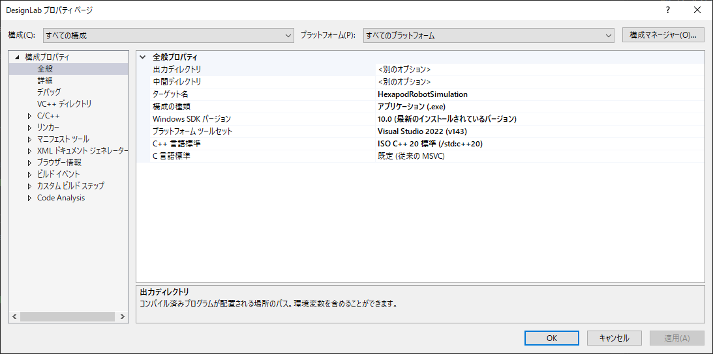
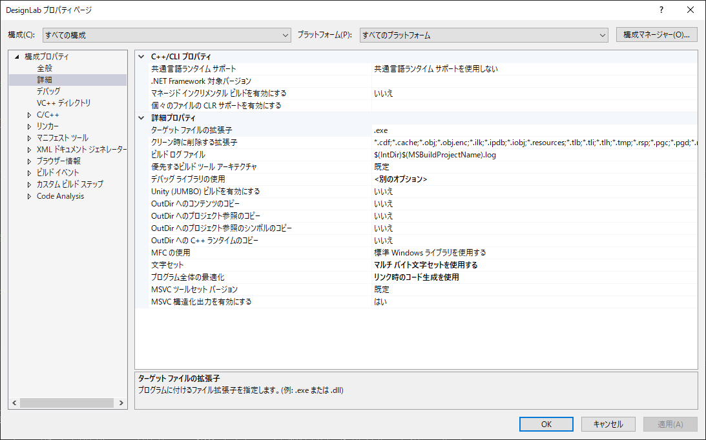
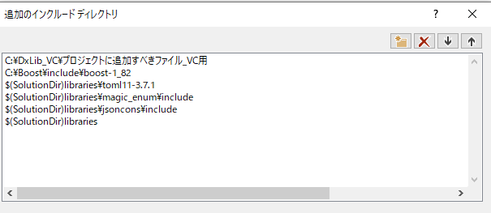

# エラーとその解決策

開発中によく発生するエラーとその解決策をまとめます．

ここの情報は，環境設定の項目で紹介した環境でのエラーと解決策です．
バージョンが異なる場合や，環境が異なる場合は参考にならないかもしれません．
適宜，Webで検索するなどして，自分の環境に合わせた解決策を見つけてください．

## ビルド/コンパイルが失敗する

多くの場合，プロジェクトのプロパティが正しく設定されていないことや，ライブラリのパスが通っていないことが原因です．
Visual Studioのエラーメッセージを確認してください．

### `LNK1104: ファイル 'libboost_system-vc143-mt-gd-x64-1_75.lib' を開くことができません。`などのリンクエラーが発生する

- 原因  
    Boostライブラリのパスが通っていない場合に発生します．
    `#include <boost/thread.hpp> が開けません` というエラーがでることもあります．

- 解決策
    [DxLib，Boostの導入方法](../docs/mark_down/how_to_install_library.md)にしたがって，ライブラリのパスを通してください．
    注意点として，「C++」->「全般」->「追加のインクルードディレクトリ」には，Boostのインクルードディレクトリを指定してください．
    (Boost1.82.0をCドライブ直下においている場合，指定するパスは `C:\Boost\include\boost-1_82`となります．)
    同様に，「C++」->「リンカー」->「全般」->「追加のライブラリディレクトリ」には，Boostのライブラリディレクトリを指定してください．
    (Boost1.82.0をCドライブ直下においている場合，指定するパスは `C:\Boost\lib`となります．)

    また，Boostのビルドがうまくいっていない場合も，このエラーが発生します．
    自身の使用しているVisual Studioのバージョンに合わせて，Boostをビルドする時の`toolset`を変更してください．
    たとえば，Visual Studio 2019を使用している場合は，`toolset=msvc-14.2`としてビルドしてください．

### `error C1083: include ファイルを開けません。'Dxlib.h':No such file or directory` などのインクルードエラーが発生する

- 原因
    DxLibのインクルードディレクトリのパスが通っていない場合に発生します．

- 解決策
    [DxLib，Boostの導入方法](../docs/mark_down/how_to_install_library.md)にしたがって，ライブラリのパスを通してください．

### magic_enum，toml11，strconv，doctestが見つからないなどのエラーが発生する

- 原因
    ライブラリのパスが通っていない場合に発生します．
    おそらく，DxLibやBoostのインクルードディレクトリのパスを設定するときに，
    設定を上書きして他のライブラリのパスを消してしまったために発生している可能性があります．

- 解決策
    下記のプロジェクトのプロパティの項目を参考に，ライブラリのパスを再設定してください．

### 標準ライブラリーが見つからない，std::formatが見つからないなどのエラーが発生する

- 原因
    本プログラムはC++20を使用していますが，プロジェクトの設定がC++20になっていない場合に発生します．

- 解決策
    プロジェクトの設定をC++20に変更してください．
    プロジェクトのプロパティを開いて，「C++」->「全般」->「C++の言語標準」を「ISO C++20標準 (/std:c++latest)」に変更してください．

## 動作がおかしい

ビルドしたプログラムが正常に動作しない場合は，Visual Studioの設定が正しく行われていない可能性があります．
また，単に設定ミスやプログラムのバグが原因であることもあります．
次の項目を参考に，問題を解決してください．

### 動作が遅い，グラフ探索が終了しない

- 原因
    構成が「Debug」になっている場合，プログラムの実行速度が遅くなります．

- 解決策
    プロジェクトの構成を「Release」に変更してください．
    プロジェクトの構成を変更するには，Visual Studioの上部メニューから「Debug」を「Release」に変更してください．
    ただし，PCの性能に起因する問題である可能性もあります．
    3DCADや3Dシミュレータのようなメモリを多く消費するプログラムを同時に起動している場合は，それらを終了してからプログラムを実行してください．

### GUIになにも表示されない，GUIがクラッシュする

- 原因
    DxLibの初期化に失敗している可能性があります．

- 解決策
    コマンドプロンプトからメニューを選択するとき，GUIが起動するのを待ってからメニューを選択してください．

### GUIが表示されない

- 原因
    設定ファイルにGUI表示を無効にする設定がされている可能性があります．

- 解決策
    `setting.toml`ファイルを開いて，`[Output]`セクションの`do_gui_display`を`true`に変更してください．
    tomlファイルは，テキストエディタで開いて編集できます．「右クリック」->「プログラムから開く」で，お使いのテキストエディタを選択してください．

## プロジェクトのプロパティ

プロジェクトのプロパティの内容のスクリーンショットを以下に掲載しておきます．
プロパティを誤って変更してしまった場合は，以下の内容に合わせて設定をもとに戻してください．

構成やプラットフォームによらない設定は，すべての構成，すべてのプラットフォームに設定して掲載しています．

また，DxLibとBoostは以下のパスに配置しています．

``` bash plaintext  
C:/
├─DxLib_VC
│  └─プロジェクトに追加すべきファイル_VC用
└─Boost
    ├─include
    │  └─boost-1_82
    │        └─boost
    └─lib   
        └─cmake
```


 
