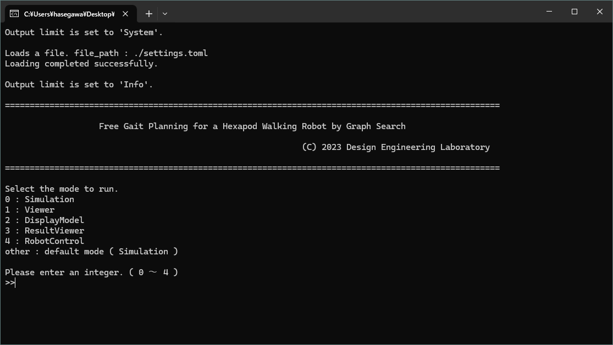
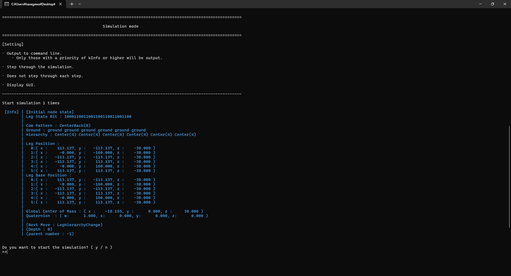
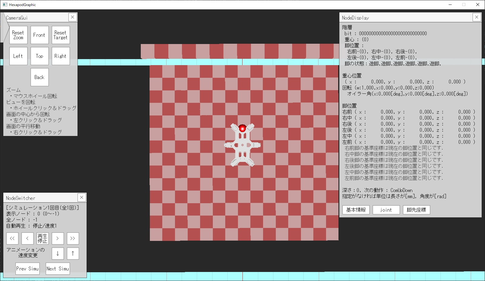
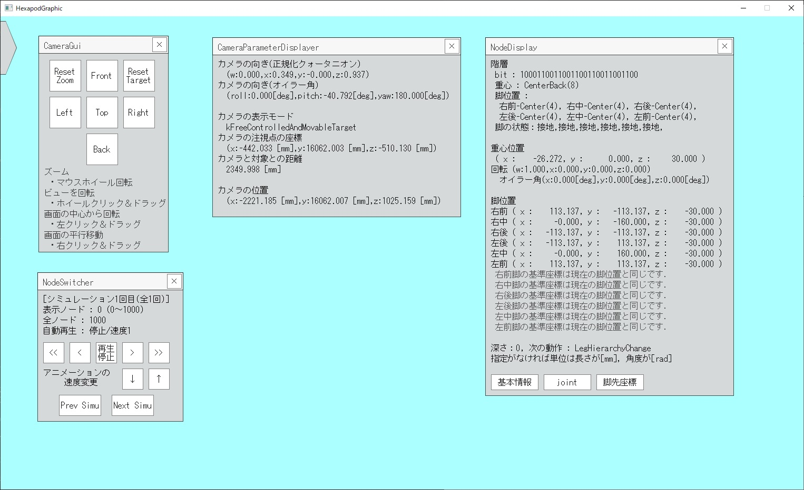
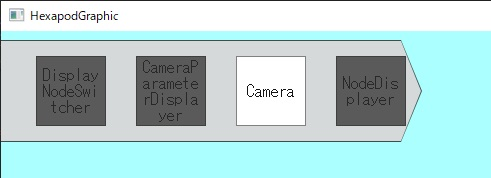
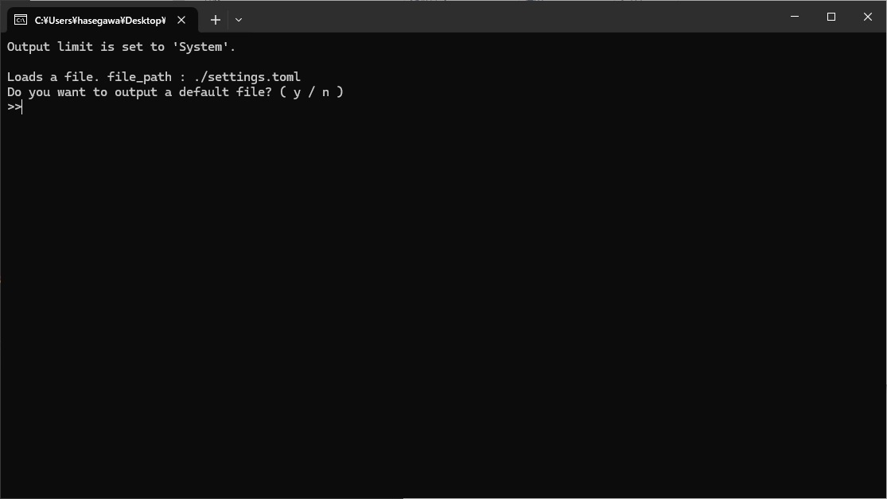

# 使い方

ここではこのソフトウェアの使い方について説明します．
ビルド済みのファイルは，Releaseから入手可能です．

起動すると，コマンドプロンプトとGUIが表示されます．
基本的には，コマンドプロンプトから操作を行い，結果をGUIで確認します．
GUIを閉じてもコマンドプロンプトは残りますが，
コマンドプロンプトを閉じるとGUIを含めてプログラムが終了します．

<div align="center">
    
</div>

起動が終了すると，上記のようなメニューが表示されます．
このメニューから，5つのモードを選択できます．
プロンプトに数字を打ち込んで，Enterを押すことでモードを選択します．
5つのモードそれぞれの使い方について以下に説明します．

## Simulation

グラフ探索を行い歩容生成を行うことができるモードです．
実行すると次のように表示されます．
左側がコマンドプロンプト，右側がGUIです．

<div align="center">
    
    
</div>

<br>

コマンドプロンプトには，以下のようなメッセージが表示されます．
yesと入力することでシミュレーションを開始します．

```bash
====================================================================================================
                                          Simulation mode
====================================================================================================
[Setting]

・Output to command line.
　　・Only those with a priority of kInfo or higher will be output.
・Step through the simulation.
・Does not step through each step.
・Display GUI.
----------------------------------------------------------------------------------------------------
Start simulation 1 times
Do you want to start the simulation? ( y / n )
>>
```

### GUIの操作方法

シミュレーション中のGUIの操作方法は以下の通りです．

- マウスの左ドラック：カメラの回転（画面中央を中心に回転）
- マウスの右ドラック：カメラの注視点の平行移動
- マウスのホイール回転：カメラのズームイン・アウト
- マウスのホイールドラック：カメラの回転（カメラの注視点を中心に回転）
- マウスの右左ドラック：カメラの回転（ホイールドラックと同じだが，回転のブレがない）
- ウィンドウの上でマウスの左ドラック：ウィンドウの移動
- ウィンドウの上でマウスの左クリック：決定

### GUI上のウィンドウ

GUI上には以下のようなウィンドウが表示されます．

- Camera：カメラの位置を変更できます．このウィンドウで位置を大まかに変更し，マウスで細かく調整します．
- NodeSwitcher : シミュレーションの切り替えやアニメーションの再生を行います．
- NodeDisplayer : ノードの情報（ロボットの状態）を表示します．
- CameraParameterDisplayer : カメラのパラメータを表示します．

<br>

<div align="center">
    
</div>

<br>

ウィンドウを画面の外に移動させた場合やウィンドウの×ボタンを押した場合は，
画面からウィンドウが消えます．
再度表示する場合は画面上の三角形ボタンをクリックしてください．
するとウィンドウターミナルが表示されます．
消えたウィンドウをクリックすると，画面に再表示されます．

<br>

<div align="center">
    
</div>

## Viewer

生成されたグラフを表示することができるモードです．
現在，このモードは不具合があるため使用しないでください．

## DisplayModel

ロボットのモデルを表示することができるモードです．

## ResultViewer

歩容生成の結果を表示することができるモードです．
Simulationモードでシミュレーションを行った後に，このモードで結果を確認します．

## RobotControl

ロボットを操作することができるモードです．
Trossen Robotics社のロボット「PhantomX Mk-III」とUSBシリアル通信を行います．
ロボットはシミュレーションの結果をもとに動作します．

シミュレーションの結果のファイルを`./robot_control/`に保存しておく必要があります．
ディレクトリごと`./result/`から結果を`./robot_control/`にコピーしてください．

実機とパソコンをUSBで接続し，デバイスマネージャでCOMポートを確認してください．
COMポートが`COM7`の場合は，[serial_communication_thread.h](../../DesignLab/serial_communication_thread.h)の
`kComPortNumber`を`7`に設定してください．

通信に失敗している場合は「スレッドは終了しています」と表示されます．
この場合は，プログラムを終了し，再度起動してください．

## はじめて実行する場合

はじめて実行する場合は設定ファイルを生成する必要があります．

```bash
Loads a file. file_path : ./settings.toml
Do you want to output a default file? ( y / n )
>>
```

次のようなメッセージが表示されるので，`y`を入力してEnterを押してください．

<div align="center">
    
</div>

## 設定ファイル

このプログラムは設定を変更する場合は設定ファイルを変更する必要があります．
設定ファイルはすべてtoml形式で記述されています．

tomlファイルを編集する場合の注意点は以下の通りです．

- `#` で始まる行はコメントとして扱われます．
- `key = value` の形式で記述します．
- `key` は文字列で，`value` は文字列，数値，真偽値，配列，テーブル，構造体のいずれかです．
- 文字列や構造体，列挙体はすべてダブルクォーテーションで囲む必要があります．
    `ex) "kHigh" "     0.000,     0.000,     0.000"`
- 文字列は大文字と小文字を区別します．また，空白を含めてはいけません．
- 数値のうち小数は明確に小数点を記述する必要があります．`ex) 0.0，1.0，-1.0`
- tomlファイルはUTF-8で記述する必要があります．

### settings.toml

アプリケーションのexeファイルと同じディレクトリに`settings.toml`が生成されます．

- `Mode` : モードに関する設定.
  - `ask_about_modes` : モード選択を行うか，falseならばデフォルトモードで起動.
  - `default_mode` : デフォルトモード，`ask_about_modes`がfalseの場合に使用.
  - `do_step_execution_each_gait` : シミュレーション時，一動作ごとにステップ実行を行うか．
  - `do_step_execution_each_simulation` : シミュレーションごとにステップ実行を行うか.
- `Output` : 出力に関する設定.
  - `cmd_output_detail` : コマンドプロンプトに出力する文字列をどこまで許可するか，たとえば`kError`に設定すると警告や情報をコマンドプロンプトに出力しない.
  - `do_cmd_output` : コマンドプロンプトに出力するか，falseならば`kSystem`以上の出力を行わない.
  - `do_gui_display` : GUIを表示するか.
  - `gui_display_quality` : GUIの画質
  - `window_fps` : ウィンドウのFPS
  - `window_size_x` : ウィンドウの横幅
  - `window_size_y` : ウィンドウの縦幅
- `Version` : バージョンに関する設定
  - `version_major` : メジャーバージョン（変更する必要はありません）
  - `version_minor` : マイナーバージョン（変更する必要はありません）
  - `version_patch` : パッチバージョン（変更する必要はありません）


```toml
[Mode]
    ask_about_modes = true
    default_mode = "kSimulation"
    do_step_execution_each_gait = false
    do_step_execution_each_simulation = true
    
[Output]
    cmd_output_detail = "kInfo"
    do_cmd_output = true
    do_gui_display = true
    gui_display_quality = "kHigh"
    window_fps = 60
    window_size_x = 1600
    window_size_y = 900
    
[Verion]
    version_major = 0
    version_minor = 5
    version_patch = 0
```